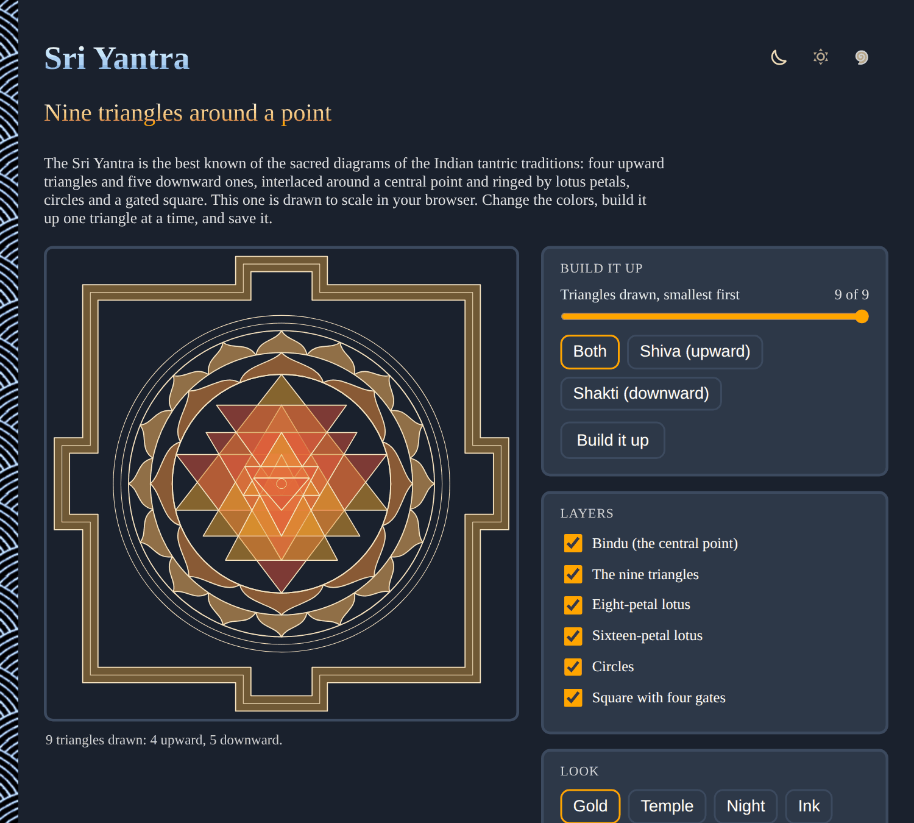

# Sri-Yantra

Draw a Sri Yantra right in your browser: nine interlocking triangles around a central point, ringed by lotus petals, circles and a gated square. Change the colors, build it up one triangle at a time, and save it as an SVG or a PNG. No sign-up and no libraries.

- [Draw the Sri Yantra](https://evoluteur.github.io/sri-yantra/)

## What it does

The Sri Yantra is the best known of the sacred diagrams of the Indian tantric traditions. Four triangles point up and five point down. The upward ones are usually read as Shiva and the downward ones as Shakti, and together they meet at the bindu, the central point.

- **Build it up**: a slider draws the triangles from the smallest to the largest, and a button plays it as an animation. Show only the upward or only the downward triangles if you like.
- **Layers**: the bindu, the nine triangles, the eight-petal lotus, the sixteen-petal lotus, the circles and the square with four gates can each be switched on and off.
- **Look**: nine color palettes (gold, temple, night, ink, saffron, emerald, slate, parchment, rose), filled or in outline, and a line weight slider.
- **Save**: **Download PNG** (2000 pixels square) or **Download SVG**.

The page also lists the nine enclosures (avaranas) from the outside in, with their Sanskrit names and their usual glosses.

## About the drawing

The triangle coordinates come from the [Sri Yantra example on TeXample.net](https://texample.net/tikz/examples/sri-yantra/) (CC BY-SA 4.0). The two largest triangles have their corners on the circle and every triangle is symmetric left to right. The lotus petals follow the same example. Practitioners may prefer other proportions, and there are several schools of drawing. A hand-drawn yantra is a matter of practice and not just geometry.

## How it is built

The pages are plain HTML, CSS and JavaScript, with no dependencies and no build step. Just open `index.html`. It is also a small installable web app: add it to your home screen or desktop and it works offline.

- The whole yantra is one SVG built from the triangle data in [js/yantra-data.js](https://github.com/evoluteur/sri-yantra/blob/main/js/yantra-data.js), and the app logic is in [js/yantra.js](https://github.com/evoluteur/sri-yantra/blob/main/js/yantra.js).
- Three color themes (dark, light and blue) are shared with my other projects.
- Your settings are kept in the browser's local storage.

Sri-Yantra is open source at [GitHub](https://github.com/evoluteur/sri-yantra) with MIT license.

Had fun browsing the app? [Buy me a coffee by becoming a sponsor](https://github.com/sponsors/evoluteur).

You may also be interested in my other sacred geometry projects [Mandala-Maker](https://github.com/evoluteur/mandala-maker) ([demo](https://evoluteur.github.io/mandala-maker/)) and [Sacred-Geometry](https://github.com/evoluteur/sacred-geometry) ([demo](https://evoluteur.github.io/sacred-geometry/)). For more mystic arts as small web apps, see [Esoterica](https://evoluteur.github.io/projects/esoterica.html).

Copyright (c) 2026 [Olivier Giulieri](https://evoluteur.github.io/).
